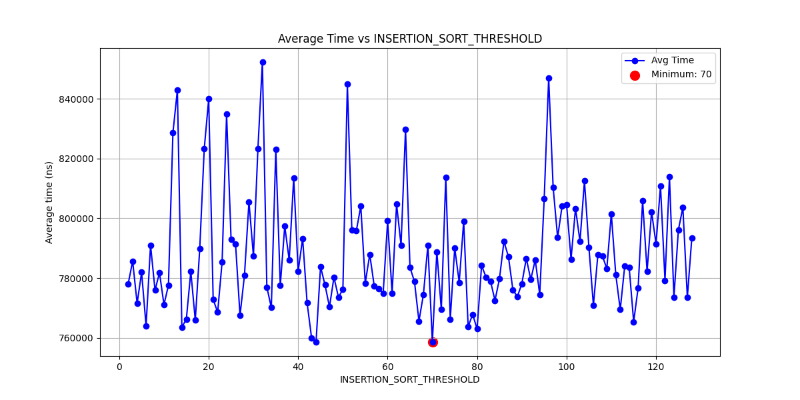
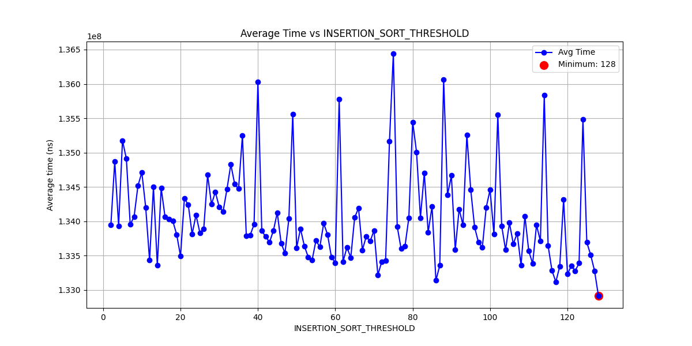
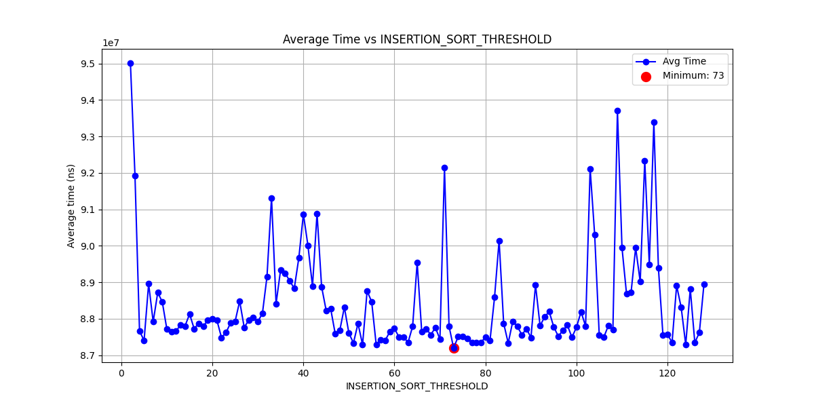

# Тесты
в src/Tests.cpp реализованы тесты на:
* пустой контейнер
* один элемент
* предварительно отсортированный контейнер
* отсортированный в обратном порядке
* наличие повторяющихся элементов
* сортировку с пользовательским компаратором
* сортировку пользовательского типа Person
Все тесты кроме последнего работают с int, т к просто проверяют правильность реализации.

# Перформансы
Для замеров перформанса алгоритма реализован ряд ф-ий в PerformanceTest.hpp, для генерации рандомных векторов различных типов данных, а также ф-я __run_perf_test__, которая запускает в пяти итерациях сортировку на заданном векторе и мерит среднее время. также она делает "прогрев" на одном запуске. 

# Подбор INSERTION_SORT_THRESHOLD
PerformanceTest.hpp содержит код для подбора показателя __INSERTION_SORT_THRESHOLD_LOCAL__ - размер массива, начиная с которого будет использоваться сортировка вставками, которая лучше работает на небольших массивах.

тест проводился на std::vector<int>(10000)
вычисляя среднее на 10 запусках для рандомно сгенерированных данных, почти отсортированных данных и данных с большим кол-вом дубликатов.

рандомные данные

лучший результат - 63. Зафиксируем его для дальнейших измерений.

почти отсортированные конечно же лучше сортируются вставками, поэтому pivot такой большой

с большим количеством дублликатов

# Оптимизаций
В лабораторной реализованы четыре оптимизации
1. ENABLE_MOVE_SEMANTICS Использует перемещение (move) вместо копирования объектов при перестановках.
2. ENABLE_MEDIAN_OF_THREE При выборе опорного элемента (pivot) вместо просто первого или последнего элемента берёт медиану из трёх элементов: первый, средний и последний.
3. ENABLE_INSERTION_SORT Для маленьких подмассивов (меньше INSERTION_SORT_THRESHOLD) QuickSort не рекурсирует, а сортирует вставками (Insertion Sort).
4. ENABLE_TAIL_RECURSION_ELIMINATION Вместо двух рекурсивных вызовов для каждого разделённого массива, делает один рекурсивный вызов и цикл для второго подмассива. Что уменьшает риск переполнения стэка.